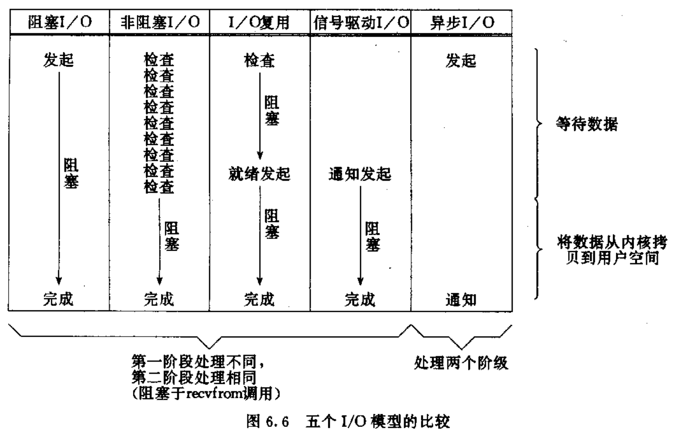
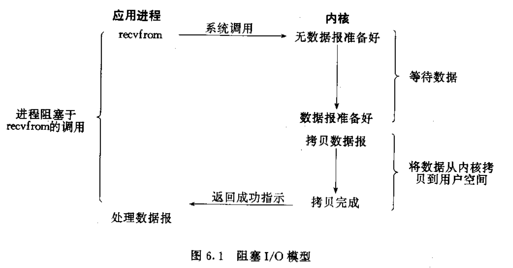
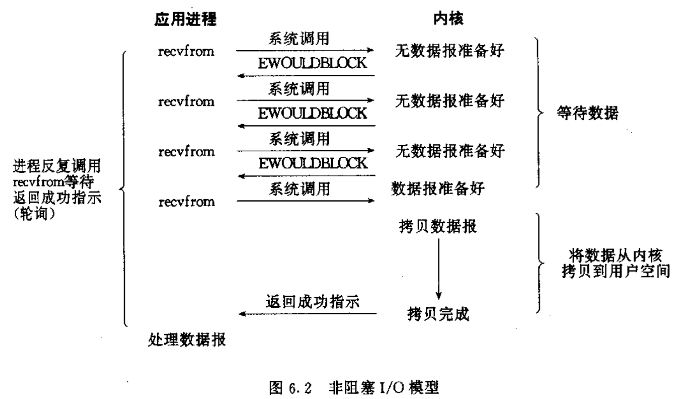
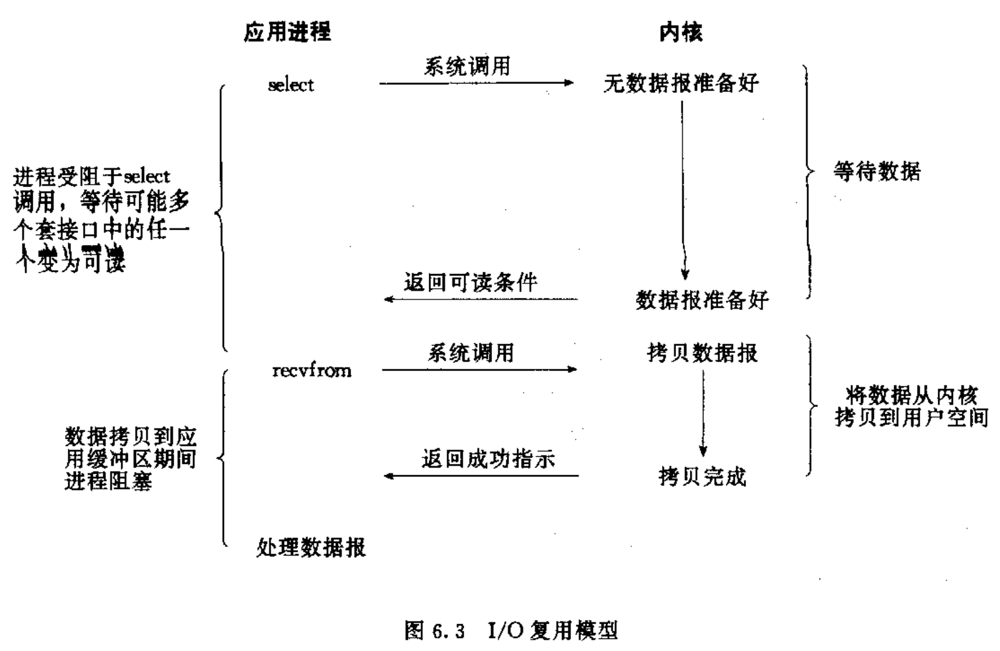
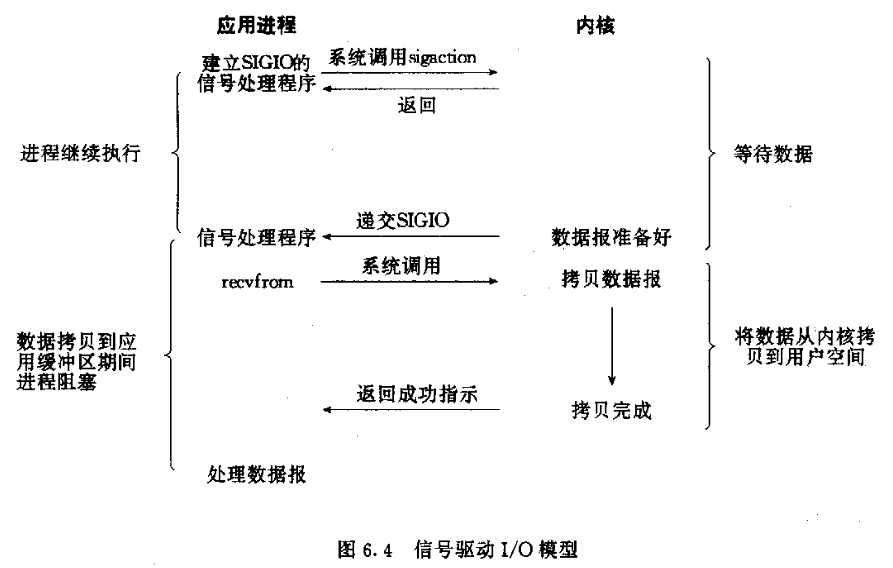
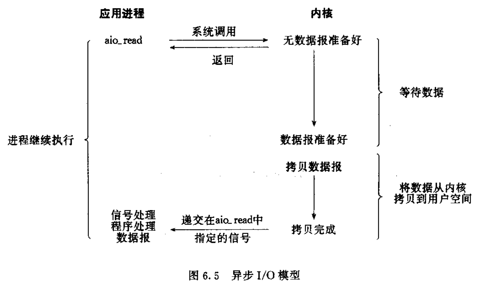

# Network Introduction

books:
- UNIX网络编程卷1：套接字API 
- UNIX网络编程卷2：进程间通信 
- TCP/IP Illustrated, Volume 1: The Protocols
- TCP IP Illustrated, Volume 2: The Implementation
- Understanding Linux Network Internals 

more books:
- The Linux Programming Interface 
- Advanced Programming in the UNIX Environment 

# 术语
## I/O模型

> UNIX网络编程卷1：套接字API - 6.2 I/O模型

- 阻塞I/O
- 非阻塞I/O
- I/O复用: `select`, `poll`
- 信号驱动I/O: `SIGIO`
- 异步/IO: POSIX.1 `aio_`

对一个套接口上的输入操作, 有两个阶段:
- 1. 等待数据到达网络, 当分组到达时, 它被拷贝到内核的某个缓冲区.
- 2. 将数据从内核缓冲区拷贝到应用缓冲区.


<!--  -->


## 阻塞/非阻塞

<!--  -->


- `recvfrom`: 有一个从应用进程中运行到内核中运行的切换, 再跟一个返回到应用进程的切换.
- `recvfrom`直到数据报到达且拷贝到应用缓冲区或是出错才返回.
- 进程阻塞的时间: 从调用`recvfrom`开始到它返回的这段时间.
- 轮询(polling): 循环调用`recvfrom`, 不断查询内核, 看某个操作是否准备好.

> UNIX网络编程卷1：套接字API - 15. 非阻塞I/O

缺省情况下, 套接字是阻塞方式的, 这意味着当一个套接口调用不能立即完成时, 进程进入睡眠状态, 等待操作完成.

<!--  -->


- 将套接口设置成非阻塞方式, 即通知内核: 当请求的I/O操作非得让进程睡眠不能完成时, 不要让进程睡眠, 而应返回一个错误.
- 前3次调用`recvfrom`时无数据返回, 内核立即返回一个`EWOULDBLOCK`错误.
- 第4次调用`recvfrom`是数据报已准备好, 被拷贝到应用缓冲区, `recvfrom`返回成功.


## I/O复用: select, poll, epoll

<!--  -->


- 调用`select`或`poll`, 在这些系统调用的某一个上阻塞, 而不是阻塞于真正的I/O系统调用.
- 阻塞于`select`调用, 等待数据报套接口可读: 等待可能多个套接口中的任一个变为可读.
- 当`select`返回套接口可读条件时, 调用`recvfrom`将数据报拷贝到应用缓冲区.
## 信号驱动I/O

<!--  -->


- 使用信号, 让内核在描述字准备好时用信号`SIGIO`通知我们.
- 先允许套接口进行信号驱动I/O, 通过系统调用`sigaction`安装一个信号处理程序(该系统调用是非阻塞的, 立即返回, 进程继续工作).
- 当数据报准备好被读时, 内核为进程生成一个`SIGIO`信号.
- 可以在信号处理程序中调用`recvfrom`读数据报, 并通知主循环数据已准备好被处理, 也可以通知主循环让它读数据报.
## 同步/异步

- 同步I/O操作引起请求进程阻塞, 直到I/O完成.
- 异步I/O操作不引起请求进程阻塞.

<!--  -->


- 让内核启动操作, 并在整个操作完成(包括将数据从内核拷贝到应用缓冲区)后, 通知我们.
- 调用`aio_read`给内核传递描述字, 缓冲区指针, 缓冲区大小, 文件偏移, 并告诉内核当整个操作完成时如何通知我们(例如生成一个信号).
- `aio_read`立即返回, 进程不阻塞于等待I/O操作的完成.

# OSI Model
<!--  -->


# TCP/IP Suite

Address, Protocols:


# RFC
- [Official Internet Protocol Standards](https://www.rfc-editor.org/standards.php)

# Packet
- [pocketguide1.pdf](./pocketguide1.pdf)

# Linux Network Kernel Parameters
* [linux-network-performance-parameters](https://github.com/leandromoreira/linux-network-performance-parameters)

```shell
# sysctl 
# -a: Display all values currently available.
# -w: Use this option when all arguments prescribe a key to be set.
# -p: Use this option when all arguments prescribe a key to be set.
sysctl -a | grep net | sort | head -n 20

cat /etc/sysctl.conf | grep "net" # | grep -v "#"

# ex: echo "0" > /proc/sys/net/ipv4/tcp_tw_recycle # net.ipv4.tcp_tw_recycle has been removed from Linux in 4.12
# !tree /proc/sys/net
!cat /proc/sys/net/ipv4/tcp_keepalive_time
```

## Ubuntu Network
* https://documentation.ubuntu.com/server/explanation/networking/
* [netplan](https://github.com/canonical/netplan)
* [Ubuntu NetworkManager and netplan](https://ubuntu.com/core/docs/networkmanager/networkmanager-and-netplan)