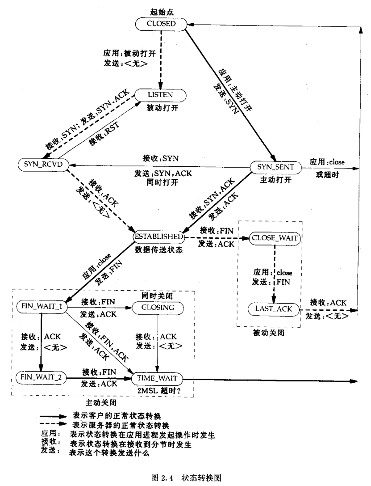

# TCP
* https://datatracker.ietf.org/doc/html/rfc793
# Protocol
> TCP/IP Illustrated, Volume 1: The Protocols 12-17
## Format
Header:

```
    0                   1                   2                   3
    0 1 2 3 4 5 6 7 8 9 0 1 2 3 4 5 6 7 8 9 0 1 2 3 4 5 6 7 8 9 0 1
   +-+-+-+-+-+-+-+-+-+-+-+-+-+-+-+-+-+-+-+-+-+-+-+-+-+-+-+-+-+-+-+-+
   |          Source Port          |       Destination Port        |
   +-+-+-+-+-+-+-+-+-+-+-+-+-+-+-+-+-+-+-+-+-+-+-+-+-+-+-+-+-+-+-+-+
   |                        Sequence Number                        |
   +-+-+-+-+-+-+-+-+-+-+-+-+-+-+-+-+-+-+-+-+-+-+-+-+-+-+-+-+-+-+-+-+
   |                    Acknowledgment Number                      |
   +-+-+-+-+-+-+-+-+-+-+-+-+-+-+-+-+-+-+-+-+-+-+-+-+-+-+-+-+-+-+-+-+
   |  Data |       |C|E|U|A|P|R|S|F|                               |
   | Offset| Rsrvd |W|C|R|C|S|S|Y|I|            Window             |
   |       |       |R|E|G|K|H|T|N|N|                               |
   +-+-+-+-+-+-+-+-+-+-+-+-+-+-+-+-+-+-+-+-+-+-+-+-+-+-+-+-+-+-+-+-+
   |           Checksum            |         Urgent Pointer        |
   +-+-+-+-+-+-+-+-+-+-+-+-+-+-+-+-+-+-+-+-+-+-+-+-+-+-+-+-+-+-+-+-+
   |                           [Options]                           |
   +-+-+-+-+-+-+-+-+-+-+-+-+-+-+-+-+-+-+-+-+-+-+-+-+-+-+-+-+-+-+-+-+
   |                                                               :
   :                             Data                              :
   :                                                               |
   +-+-+-+-+-+-+-+-+-+-+-+-+-+-+-+-+-+-+-+-+-+-+-+-+-+-+-+-+-+-+-+-+
```

- Data Offset: the number of 32-bit words in the TCP header

- CWR: Congestion Window Reduced (the sender reduced its sending rate)
- ECE: ECN-Echo (the sender received an Earlier Congestion Notification)
- URG: Urgent point field is significant
- ACK: Acknowledgement field is significant
- PSH: Push function (the receiver should pass this data to the application ASAP, not reliably implemented or used)
- RST: Reset the connection (connection abort, usually because of an error)
- SYN: Synchronize sequence numbers to intiate a connection
- FIN: No more data from sender

- Window: the amount of empty spaces (in bytes) remainning in the receiver buffer 

options:
- MSS: Maximum Segment Size
- SACK
- Timestamp
- Window Scale
- ...
!packetdiag -f C:/Windows/Fonts/DejaVuSansMono.ttf -o diag/tcp-rfc9293.png diag/tcp-rfc9293.diag
from IPython.display import Image
Image(filename="diag\\tcp-rfc9293.png") 
## TCP Connection Management
TCP Options:
- EOL: end of option list
- NOP no operation (for padding)
- MSS: maximum segment size
- WSOPT: window scaling factor (left-shift amount on window)
- SACK-Permitted: sender supports SACK options
- SACK: SACK block (out-of-order data received)
- TSOPT: Timestamp option
- UTO: User Timeout (aboirt after idle time)
- TCP-AO: authentication option

Path MTU Discovery with TCP(PMTUD):
- SMSS: send maximum segment size
## TCP Timeout and Retransmission
RTO: retransmission timeout
## TCP Data Flow and Window Management
## TCP Congestion Control
$$
W = min(cwnd, awnd)
$$

- W: sender's actual usable window
- cwnd: congestion window, the estimate of the network's available capacity
- awnd: receiver's advertised window


flight size: 
- the total amount of data a sender has introduced into the netowrk for which it has not yet received an acknowledgement
- always <= W


BDP (bandwidth-delay product) of the network path, the optimal window size:
- equal to the product of the RTT and the capacity of the lowest capacity(bottleneck) link on the path from sender to receiver
a conservation of packets in the network: 网络中留存报文

ACK clock: the opration of TCP congestion control at a sender is driven/clocked by the receipt of ACKs.


algorithms

- slow start
  - IW: initial window
    - 2 or 3 or 4 SMSS: special case $IW = 1 \ SMSS$
  - no loss and ACKed: k round-trip, $cwnd = 2^{k}$
  - $cwnd \le ssthresh$
  - switch to congestion avoidance: $cwnd >= ssthresh$


- congestion avoidance
  - seek additional capacity by increasing $cwnd$ by approminately 1 segment for each window's worth of data that is moved from sender to receiver successfully
  - $cwnd_{t+1} = cwnd_{t} + SMSS * SMSS / cwnd_{t}$

ssthreash:
- holds the lower bound on TCP's best estimate of the optimal window size
- initial: $ssthresh = awnd$
- when retransmision occur: ssthresh = $max(flight \ size / 2, 2 * SMSS)$
## TCP Keepalive
- keepalive timer
- keepalive probe
# Linux Kernel Parameters
%env ROOT_PWD=xxx
!echo $ROOT_PWD | sudo -S sysctl -a | grep tcp | sort
# Programming
> UNIX网络编程卷1：套接字API - 2.4 TCP: 传输控制协议

- 1. TCP提供客户与服务器的连接connection.
- 2. TCP提供可靠性: TCP向另一端发送数据时, 要求对方返回一个确认.
  - 如果确认没有收到, TCP自动重传数据并等待更长时间. 数次重传失败后才放弃.
  - 动态估算客户到服务器往返时间RTT(round-trip time)的算法
- 3. TCP通过给发送数据的每个字节关联一个序列号进行排序.
  - 接收方TCP根据分节中序列号排序, 再把结果传递给应用进程.
  - 接收到重复的数据直接丢弃.
- 4. TCP提供流量控制: 总是告诉对方它能够接受多少字节的数据(通告窗口advertised window).
  - 窗口时刻动态的变化.
- 5. TCP的连接时全双工的: 在连接上的应用进程既可以发送也可以接收数据.   
> UNIX网络编程卷1：套接字API - 2.5 TCP连接的建立和终止

TCP连接建立: 三路握手

TCP连接终止

TCP状态转换图




- CLOSED: 起始点
- LISTEN: 被动打开, 预期接收SYN
- SYN_SENT: 主动打开, 发送SYN
- SYN_RCVD: 接收SYN
- ESTABLISHED: 连接建立
- CLOSE_WAIT, LAST_ACK
  - 被动关闭: 接收FIN
- FIN_WAIT_1, FIN_WAIT_2, CLOSING, TIME_WAIT
  - 主动关闭: 发送FIN

TIME_WAIT: 2MSL超时(最大分节生命期MSL: maximum segment lifetime)
- MSL是IP数据报在网络中生存的最长时间: 具有最大跳数的分组不能超过MSL还继续存在.
- 分组因路由和超时重传机制产生重复: lost duplicate, wandering duplicate
- 理由1 实现中TCP全双工连接的可靠性
  - 全双工关闭: 必须正确处理连接终止4个分节中任何一个分节的丢失情况.
  - 主动关闭端可能需要重发最终的ACK.
- 理由2 允许旧的重复分节在网络中消逝
  - TCP不能给处于TIME_WAIT状态的连接启动新的化身, 以让先前化身的老重复分组在网络中消逝.
大量TIME_WAIT或CLOSE_WAIT问题: [ref](https://blog.csdn.net/weixin_44844089/article/details/115626152)


TIME_WAIT: 主动关闭方
- socket端口占用无法释放: 无法建立连接, 消耗fd资源
- 内核参数
```
net.ipv4.tcp_tw_reuse = 1 # 允许将TIME_WAIT的socket用于新的链接
net.ipv4.tcp_tw_recycle = 1 # 开启TIME_WAIT的socket快速回收
```
- 使用连接池: 改短链接为长连接

CLOSE_WAIT: 被动关闭方
- 关闭socket不及时: IO线程被阻塞, IO线程用户任务处理不及时
- 可能是客户端不断向服务端发FIN, 或者服务端一直没有发FIN

<!--
“三次握手，四次挥手”你真的懂吗？
https://zhuanlan.zhihu.com/p/53374516

TCP提供了一种可靠、面向连接、字节流、传输层的服务，采用三次握手建立一个连接。采用4次挥手来关闭一个连接。

三次握手
 1. 客户端发送一个SYN段，并指明客户端的初始序列号，即ISN(c).
 2. 服务端发送自己的SYN段作为应答，同样指明自己的ISN(s)。为了确认客户端的SYN，将ISN(c)+1作为ACK数值。这样，每发送一个SYN，序列号就会加1. 如果有丢失的情况，则会重传。
 3. 为了确认服务器端的SYN，客户端将ISN(s)+1作为返回的ACK数值。

客户端和服务端通信前要进行连接，“3次握手”的作用就是双方都能明确自己和对方的收、发能力是正常的。

(ACK是确认下一可接收的序列号ISN)

四次挥手

 1. 客户端发送一个FIN段，并包含一个希望接收者看到的自己当前的序列号K. 同时还包含一个ACK表示确认对方最近一次发过来的数据。 
 2. 服务端将K值加1作为ACK序号值，表明收到了上一个包。这时上层的应用程序会被告知另一端发起了关闭操作，通常这将引起应用程序发起自己的关闭操作。 
 3. 服务端发起自己的FIN段，ACK=K+1, Seq=L 
 4. 客户端确认。ACK=L+1

而关闭连接时，当收到对方的FIN报文时，仅仅表示对方不再发送数据了但是还能接收数据，己方是否现在关闭发送数据通道，需要上层应用来决定，因此，己方ACK和FIN一般都会分开发送。

TCP KeepAlive机制理解与实践小结 
https://www.cnblogs.com/hueyxu/p/15759819.html

HTTP 长连接和 TCP 长连接有区别？
https://www.51cto.com/article/741263.html

HTTP 的 Keep-Alive，是由应用层（用户态）实现的，称为 HTTP 长连接；
  使用同一个 TCP 连接来发送和接收多个 HTTP 请求/应答，避免了连接建立和释放的开销，这个方法称为 HTTP 长连接
  HTTP 1.0 Connection: Keep-Alive
  HTTP 1.1 默认是开启了 Keep-Alive
    关闭 Keep-Alive Connection:close
TCP 的 Keepalive，是由TCP 层（内核态）实现的，称为 TCP 保活机制；
  当客户端和服务端长达一定时间没有进行数据交互时，内核为了确保该连接是否还有效，就会发送探测报文，来检测对方是否还在线，然后来决定是否要关闭该连接

4.2 TCP 重传、滑动窗口、流量控制、拥塞控制
https://xiaolincoding.com/network/3_tcp/tcp_feature.html

TCP 拥塞控制算法
https://zhuanlan.zhihu.com/p/59656144

-->