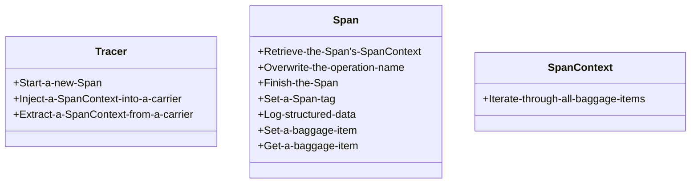

# Distributed Tracing
books:
- Yuri Shkuro. Mastering Distributed Tracing. Packt Publishing, 2019.

# Mastering Distributed Tracing

Part I Introduction
- 1 Why Distributed Tracing
- 2 Taking Tracing for a HotROD ride
- 3 Distributed Tracing Fundamentals

Part II Data Gathering Problem
- 4 Instrumentation Basics with OpenTracing
- 5 Instrumentation of Asynchronous Applications
- 6 Tracing Standards and Ecosystem
- 7 Tracing with Service Mesh
- 8 All About Sampling

Part III Getting Value from Tracing
- 9 Turning the Lights On
- 10 Distributed Context Propagation
- 11 Integration with Metrics and Logs
- 12 Gathering Insights Through Data Mining

Part IV Deploying and Operating Tracing Infrastructure
- 13 Implementing tracing in large organizations
- 14 Under the Hood of a Distributed Tracing System
## terms

distributed tracing: 分布式跟踪; an observability tool to address the challenges of monitoring and troubleshooting distributed systems.

end-to-end tracing<br/>
workflow-centric tracing

trace: 轨迹; 分布式系统中请求被处理的完整路径, 由事件图构成, 节点为事件, 边为事件间的因果关系.

trace point: 代码中编排的跟踪点, 例如客户端代码在Web服务器请求中可以编排两个跟踪点: 发送请求和接收响应.

instrumentation: 编排; 织入.

observability: 可观察性.

service dependency graph: 服务依赖图.

distributed transaction: 处理请求的链.

execution, request: 系统代客户端或请求发起者执行的工作.

## 分布式跟踪解决什么问题

分布式组件在处理请求的协同流程中上下文信息和处理顺序信息的可观察性问题.


## 分布式跟踪的工作机制

分布式跟踪是以请求为核心的, 捕捉分布式系统组件在处理请求的过程中执行的因果相关活动的详细信息.

- (1) 跟踪基础设施在每个请求上附加上下文元数据(contextual metadata), 确保元数据会随请求的执行传递;
- (2) 在代码中的跟踪点(trace point), 记录标记了相关信息的事件(event), 这些信息包括HTTP请求的URL、数据库查询的SQL语句等;
- (3) 记录的事件标记有上下文元数据和与之前的事件的显式因果联系(causality reference).

anatomy of distributed tracing


- Execution Flow: 执行流
- Causality, profiling data: 因果性, 测量数据
- Trace points: 跟踪点
- Inject/Extract Trace points: 注入/提取跟踪点. 跨进程传递的元数据的编解码

- Req: 请求
- Res: 响应
- Microservice-N: 微服务实例
- Tracing API: 跟踪API
- Tracing library: 跟踪库是跟踪API的实现, 将收集的数据报告给跟踪后端
- Collection/Normalization(Trace Model): 跟踪后端接收到跟踪数据, 将其按通用的跟踪模型表示来标准化, 并存储到跟踪存储中
- Trace Storage: 跟踪数据的存储
- Trace Reconstruction: 重构轨迹
- Data Mining: 跟踪数据的聚合和数据挖掘
- Presentation, Visualization: 轨迹的表示和可视化

- 因果性关系: Lamport的happens-before关系


## 运用分布式跟踪

OpenTracing项目

解决的问题: 提供厂商独立的API和常见框架的编排织入库.

两个主要实体:

- tracer: 负责创建span, 暴露出跨进程和组件边界传递上下文信息的方法的单例.
- span: 实现应用中特定跟踪点的接口. 在span模型上下文中, span表示应用在一次分布式执行中的工作单元, 这个工作单元的名称称为操作名称(operation name). 每个span有开始和结束时间, 大多数情况下还包含在一次执行中到其前继的因果连接.


# OpenTracing
- The OpenTracing Semantic Specification: https://opentracing.io/specification/
- OpenTracing API for Go: https://github.com/opentracing/opentracing-go
- Jaeger: open source, end-to-end distributed tracing: https://www.jaegertracing.io/

> The OpenTracing project is archived. Migrate to OpenTelemetry today!
> - [CNCF Archives the OpenTracing Project](https://www.cncf.io/blog/2022/01/31/cncf-archives-the-opentracing-project/) - 2022-01-31 

> Vendor-neutral APIs and instrumentation for distributed tracing

分布式跟踪提供了描述和分析跨进程事务的解决方案, 用例可以参考Google的Dapper论文[^1], 包括: 异常检测、诊断稳定状态问题、分布式定量分析、微服务中资源归属和工作负载建模等.

概念模型[^2]:


```
Service A             Network Call       Service B
-------------------- .............. --------------------
Parent Span    |       Span Context   Child Span
 |Child Span   |Log                    |Log    |Log
    |Child Span
      |Log  |Log
```

- `Trace`: 描述事务在分布式系统中的移动.
- `Span`: 标识工作流中一部分的命名的耗时的操作, 可以有键值对标签、细粒度的带时间戳的结构化日志.
- `Span Context`: 表示分布式事务携带的跟踪信息, 包括它何时通过网络或消息队列在服务间移动的. 包含Trace id, Span id和跟踪系统需要传播给下游服务的数据.


具体的, 在其语义规范[^3]中, `Span`封装了状态:

- 操作名称
- 开始时间戳
- 结束时间戳
- 键值对标签: 键为字符串, 值为字符串、布尔或数值类型
- `SpanContext`
- `Reference`: 对因果相关的`Span`的引用

`SpanContext`封装了状态:

- 跨进程边界引用不同`Span`所需的独立于实现的状态
- 跨进程边界的键值对: 包裹项(Baggage Items)

规范中抽象了两种`Reference`:

- `ChildOf`: 父Span依赖于子Span;
- `FollowsFrom`: 父Span不依赖于子Span.


规范中描述了三个关键类型的接口, 可以参考一些第三方实现[^4]:





[^1]: Sigelman, B. H.; Barroso, L. A.; Burrows, M. & et al. Dapper, a Large-Scale Distributed Systems Tracing Infrastructure. Google, Inc., 2010

[^2]: OpenTracing: https://opentracing.io/

[^3]: The OpenTracing Semantic Specification: https://github.com/opentracing/specification/blob/master/specification.md

[^4]: 3rd-Party OpenTracing API Contributions: https://github.com/opentracing-contrib

# OpenTelemetry
* https://opentelemetry.io/
- vendors: https://opentelemetry.io/ecosystem/vendors/
- integrations: https://opentelemetry.io/ecosystem/integrations/
- OTLP: OpenTelemetry protocol, https://opentelemetry.io/docs/specs/otel/protocol/

> OpenTelemetry, also known as OTel, is a vendor-neutral open source Observability framework for instrumenting, generating, collecting, and exporting telemetry data such as traces, metrics, and logs.


> What is OpenTelemetry?
> - An [Observability](https://opentelemetry.io/docs/concepts/observability-primer/#what-is-observability) framework and toolkit designed to create and manage telemetry data such as [traces](https://opentelemetry.io/docs/concepts/signals/traces/), [metrics](https://opentelemetry.io/docs/concepts/signals/metrics/), and [logs](https://opentelemetry.io/docs/concepts/signals/logs/).
> - Vendor- and tool-agnostic, meaning that it can be used with a broad variety of Observability backends, including open source tools like [Jaeger](https://www.jaegertracing.io/) and [Prometheus](https://prometheus.io/), as well as commercial offerings.
> - Not an observability backend like Jaeger, Prometheus, or other commercial vendors.
> - Focused on the generation, collection, management, and export of telemetry. A major goal of OpenTelemetry is that you can easily instrument your applications or systems, no matter their language, infrastructure, or runtime environment. The storage and visualization of telemetry is intentionally left to other tools.


more: [Cloud Native Go.ipynb](../Cloud%20Native/Cloud%20Native%20Go.ipynb)
Language APIs & SDKs
- OTLP Exporter Configuration: https://opentelemetry.io/docs/languages/sdk-configuration/otlp-exporter
- [Logger MDC auto-instrumentation](https://github.com/open-telemetry/opentelemetry-java-instrumentation/blob/main/docs/logger-mdc-instrumentation.md): `trace_id`, `span_id`, `trace_flags`
```yaml
logging.pattern.level: trace_id=%mdc{trace_id} span_id=%mdc{span_id} trace_flags=%mdc{trace_flags} %5p
```
# Ganglia
* https://github.com/ganglia/

> What is Ganglia?
>
> Ganglia is a scalable distributed monitoring system for high-performance computing systems such as clusters and Grids. It is based on a hierarchical design targeted at federations of clusters. It leverages widely used technologies such as XML for data representation, XDR for compact, portable data transport, and RRDtool for data storage and visualization. It uses carefully engineered data structures and algorithms to achieve very low per-node overheads and high concurrency. The implementation is robust, has been ported to an extensive set of operating systems and processor architectures, and is currently in use on thousands of clusters around the world. It has been used to link clusters across university campuses and around the world and can scale to handle clusters with 2000 nodes.

# Jaeger
- [Home](https://www.jaegertracing.io/)
- [Code](https://github.com/jaegertracing/jaeger)
- paper: Dapper, a Large-Scale Distributed Systems Tracing Infrastructure
- book: Mastering Distributed Tracing

> Jaeger: open source, distributed tracing platform
> Jaeger is a distributed tracing platform released as open source by Uber Technologies . 
> With Jaeger you can:
>
>- Monitor and troubleshoot distributed workflows
>- Identify performance bottlenecks
>- Track down root causes
> - Analyze service dependencies
## Components
- **Tracing SDKs**: Jaeger clients(*retired*), OpenTelemetry SDKs
- **jaeger-agent**: *deprecated*, daemon listen for spans sent over UDP, batched to collector
- **jaeger-collector**: receive traces, run them through a processing pipeline, store them in storage backend
- **jaeger-query**: expose APIs for retrieve traces from storage backend
- **jaeger-ingester**: read traces from Kafka, write them to storage backend
## APIs
- https://www.jaegertracing.io/docs/1.56/apis/
- Span reporting APIs
	- OpenTelemetry Protocol(OLTP)
	- Thrift over UDP
	- Protobuf via gRPC
	- Thrift over HTTP
	- JSON over HTTP
	- Zipkin Formats
- Trace retrieval APIs
	- gRPC/Protobuf
	- HTTP JSON
- Remote Storage API
- Remote Sampling Configuration
- Service dependencies graph
- Service Performance Monitoring